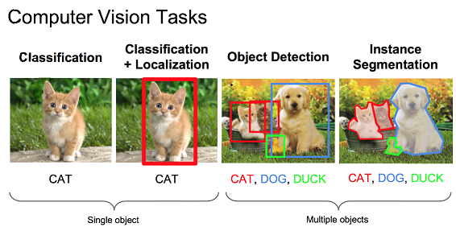
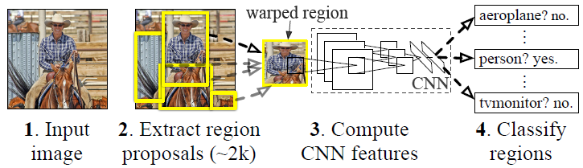
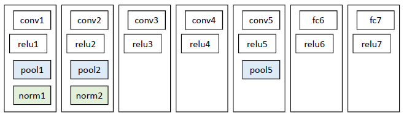
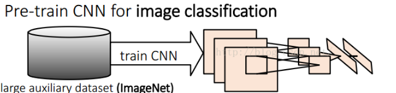
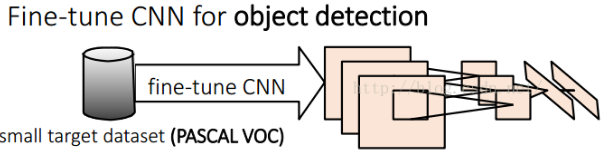
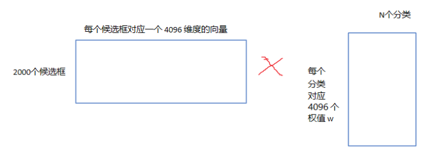
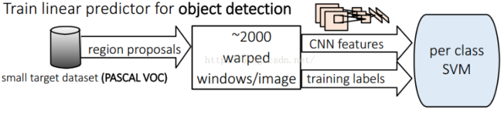

[TOC]

# Report in R-CNN

>该篇报告主要介绍的是
>
>***Rich feature hierarchies for accurate object detection and semantic segmentation***
>
>《用于精确物体定位和语义分割的丰富特征层次结构》
>
>也就是业界常说的R-CNN,R-CNN系列论文是深度学习在**物体检测**领域的开端，其中fast-RCNN和faster-RCNN都沿袭了R-CNN的思路，R-CNN是第一个真正的工业级应用的解决方案。可以说改变了目标检测的主要研究思路。
>
>该片报告主要是介绍R-CNN网络结构及检测过程，不涉及模型评测部分。
>
>主要参考：
>
>R-CNN论文[链接](https://arxiv.org/pdf/1311.2524.pdf)	
>
>R-CNN要点详细[解释](https://zhuanlan.zhihu.com/p/23006190)	

## Extra Infomation

再介绍R-CNN检测之前我们先要理解什么是物体检测，物体检测与图像分类不同，检测需要在图像中定位目标。及先定位目标物体然后判断目标物体的类别。及Localization和Recognition相比于图像分类难度大大提高。

一种方法是将定位作为一个回归问题，但是实践表明这种策略的效果并不好，在VOC的数据集上准确率并不好

另一种方法是构建一个滑动窗口检测器。 CNN已经以这种方式被使用了至少二十年，通常是在受限物体上，如面部和行人。为了保持高空间分辨率，这些CNN通常只有两个卷积和池化层。R-CNN中采用了滑动窗口检测的方法。

## Introduction

整个R-CNN过程由三个模块构成：

- 第一个模块生成无关类别的区域提案
- 第二个模块一个大型的卷积神经网络，可以从每个提案中提取出固定长度的特征向量
- 第三个模块是一组特定类别的线性SVM

## Region Proposals (区域提案)

R-CNN中的Region Proposals 是一个很重要的部分，它采用了selective search算法，采取过分割，将图像分割成小区域，再通过颜色直方图，梯度直方图等规则进行合并，最后提取了大约2000个建议框（Region）。候选区域生成和后续步骤相对独立，实际可以使用任意算法进行。

Selective Search算法详情见[链接](https://blog.csdn.net/mao_kun/article/details/50576003)

##### 基本思路

- 使用一种过分割手段，将图像分割成小区域 （1k~3k）
- 查看现有小区域，合并可能性最高的两个区域。重复直到整张图像合并成一个区域位置 
- 输出所有曾经存在过的区域，所谓候选区域

##### 合并规则

优先合并以下四种区域：

- 
  颜色（颜色直方图）相近的 
- 纹理（梯度直方图）相近的 
- 合并后总面积小的 
- 合并后，总面积在其BBOX中所占比例大的

##### 多样化与后处理

为尽可能不遗漏候选区域，上述操作在多个颜色空间中同时进行（RGB,HSV,Lab等）。在一个颜色空间中，使用上述四条规则的不同组合进行合并。所有颜色空间与所有规则的全部结果，在去除重复后，都作为候选区域输出。作者提供了Selective Search的[源码](http://koen.me/research/selectivesearch/)

## Feature extraction (特征提取)

这一部分利用深度学习神经网络进行特征的提取，当然其中包括一些基础知识

##### 基本知识

**重叠度IOU**

物体检测需要定位出物体的bounding box，就像下面的图片一样，我们不仅要定位出车辆的bounding box 我们还要识别出bounding box 里面的物体就是车辆。

 对于bounding box的定位精度，有一个很重要的概念： 因为我们算法不可能百分百跟人工标注的数据完全匹配，因此就存在一个定位精度评价公式：IOU。 它定义了两个bounding box的重叠度，如下图所示

就是矩形框A、B的重叠面积占A、B并集的面积比例。通过这个比例判定候选框是否正确。

**关于正负样本选择**：

一张照片我们得到了2000个候选框。然而人工标注的数据一张图片中就只标注了正确的bounding box，我们搜索出来的2000个矩形框也不可能会出现一个与人工标注完全匹配的候选框。因此在CNN阶段我们需要用IOU为2000个bounding box打标签。如果用selective search挑选出来的候选框与物体的人工标注矩形框（PASCAL VOC的图片都有人工标注）的重叠区域IoU大于0.5，那么我们就把这个候选框标注成物体类别（正样本），否则我们就把它当做背景类别（负样本）。

正样本 
本类的真值标定框。 
负样本 
考察每一个候选框，如果和本类所有标定框的重叠都小于0.3，认定其为负样本

##### 预处理

在利用神经网络提取特征之前，首先把候选区域归一化成同一尺寸的227 ✖️ 227 的图片

注意：外扩的尺寸大小，形变时是否保持原比例，对框外区域直接截取还是补灰。会轻微影响性能。

##### 预训练

网络架构有两个可选方案：第一选择经典的Alexnet；第二选择VGG16。经过测试Alexnet精度为58.5%，VGG16精度为66%。VGG这个模型的特点是选择比较小的卷积核、选择较小的跨步，这个网络的精度高，不过计算量是Alexnet的7倍。后面为了简单起见，就直接选用Alexnet，并进行讲解；Alexnet特征提取部分包含了5个卷积层、2个全连接层，在Alexnet中p5层神经元个数为9216、 f6、f7的神经元个数都是4096，通过这个网络训练完毕后，最后提取特征每个输入候选框图片都能得到一个4096维的特征向量。

物体检测的一个难点在于，物体标签训练数据少，如果要直接采用随机初始化CNN参数的方法，训练数据量是远远不够的。这种情况下，最好的是采用某些方法，把参数初始化了，然后在进行有监督的参数微调，文献中采用的是有监督的预训练。所以paper在设计网络结构的时候，是直接用Alexnet的网络，然后连参数也是直接采用它的参数，作为初始的参数值，然后再fine-tuning训练。

网络结构如下：

预训练：

##### fine-tune 调优

接着采用selective search 搜索出来的候选框，然后处理到指定大小图片，继续对上面预训练的cnn模型进行fine-tuning训练。假设要检测的物体类别有N类，那么我们就需要把上面预训练阶段的CNN模型的最后一层给替换掉，替换成N+1个输出的神经元(加1，表示还有一个背景) (20 + 1bg)，然后这一层直接采用参数随机初始化的方法，其它网络层的参数不变；接着就可以开始继续SGD训练了。

开始的时候，SGD学习率选择0.001，在每次训练的时候，我们batch size大小选择128，其中32个事正样本、96个事负样本

>可以直接用AlextNet和已经训练好的参数作为特征提取的手段，省去fine-tuning。
>
>如果你不进行fine-tuning，也就是你直接把Alexnet模型当做万金油使用，类似于HOG、SIFT一样做特征提取，不针对特定的任务。然后把提取的特征用于分类，结果发现p5的精度竟然跟f6、f7差不多，而且f6提取到的特征还比f7的精度略高；如果你进行fine-tuning了，那么f7、f6的提取到的特征最会训练的svm分类器的精度就会飙涨。

## Linear SVM Classify (线性SVM分类)

用20个线性SVM对剩余从框中提取出来的特征进行二分类打分，然后选取20个类中分最高的类为输出类别。

因为在训练样本中负样本远多于正样本。所以可以用Hard-Negative-Mining进行

##### 训练阶段：

得到的特征输入到SVM进行分类看看这个feature vector所对应的region proposal是需要的物体还是无关的实物(background) 。 排序，canny边界检测之后就得到了我们需要的bounding-box。

**位置精修**

目标检测问题的衡量标准是重叠面积：许多看似准确的检测结果，往往因为候选框不够准确，重叠面积很小。故需要一个位置精修步骤。 回归器：对每一类目标，使用一个线性脊回归器进行精修。正则项λ=10000。 输入为深度网络pool5层的4096维特征，输出为xy方向的缩放和平移。 训练样本：判定为本类的候选框中和真值重叠面积大于0.6的候选框。

##### 测试阶段

测试阶段中使用贪心的非极大值抑制（NMS）去除相交的多余的框。

使用selective search的方法在测试图片上提取2000个region propasals ，将每个region proposals归一化到227x227，然后再CNN中正向传播，将最后一层得到的特征提取出来。然后对于每一个类别，使用为这一类训练的SVM分类器对提取的特征向量进行打分，得到测试图片中对于所有region proposals的对于这一类的分数，再使用贪心的非极大值抑制（NMS）去除相交的多余的框。再对这些框进行canny边缘检测，就可以得到bounding-box(then B-BoxRegression)。

## Summary(检测流程综述)

1. 输入一张多目标图像，采用selective search算法提取约2000个建议框；
2. 先在每个建议框周围加上16个像素值为建议框像素平均值的边框，再直接变形为227×227的大小；
3. 先将所有建议框像素减去该建议框像素平均值后，再依次将每个227×227的建议框输入AlexNet CNN网络获取4096维的特征，2000个建议框的CNN特征组合成2000×4096维矩阵；
4. 将2000×4096维特征与20个SVM组成的权值矩阵4096×20相乘【20种分类，SVM是二分类器，则有20个SVM】，获得2000×20维矩阵表示每个建议框是某个物体类别的得分；
5. 分别对上述2000×20维矩阵中每一列即每一类进行非极大值抑制（NMS）剔除重叠建议框，得到该列即该类中得分最高的一些建议框；
6. 分别用20个回归器对上述20个类别中剩余的建议框进行回归操作，最终得到每个类别的修正后的得分最高的bounding box。

