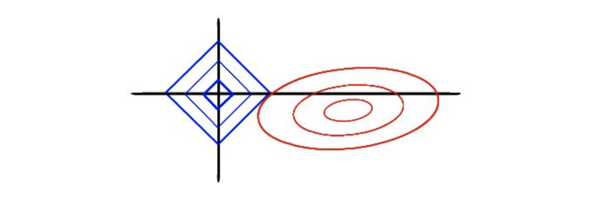
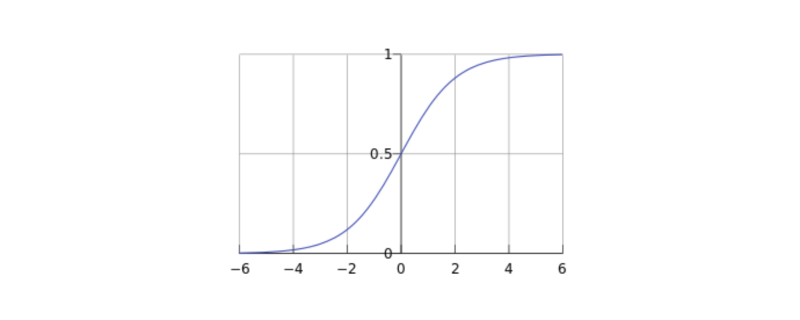

# 线性回归总结

>Author:Zreal
>
>参考：
>
>- <https://blog.yaodataking.com/2017/02/28/machine-learning-2/>
>- <https://zhuanlan.zhihu.com/p/30535220>
>- <https://zhuanlan.zhihu.com/p/28408516>

[TOC]

## 理论总结：

### Linear Regression

线性回归用最适直线(回归线)去建立因变量Y和一个或多个自变量X之间的关系。可以用公式来表示：			
$$
Y=w^T*X+b
$$

如何确定w和b？显然，关键在于如何衡量f(x)于y之间的差别。均方误差是回归任务中最常用好的性能度量，因此我们可以试图让均方误差最小化，（之后很多类型的回归都是在损失函数上进行修改）
$$
argmin \sum_{i=1}^m (f(x_i)-y_i)^2
$$

$$
argmin \sum_{i=1}^m (f(x_i)-w*x_i-b)^2
$$
之后根据最小二乘法得到最优解的闭式解，或者利用梯度下降法无限逼近最优闭式解。

（训练过程跳过）

### Ridge Regression

岭回归是一种专用于共线性数据分析的有偏估计回归方法，实质上是一种改良的最小二乘估计发，通过放弃最小二乘法的无偏性，以损失部分信息，降低精度为代价获得得回归系数更加符合实际，更可靠的回归方法，**对病态数据的拟合要强于最小二乘法**

损失函数公式如下：
$$
argmin (\sum_{i=1}^m (f(x_i)-y_i)^2+alpha*\sum_{i=1}^m w_i^2）
$$
损失函数中添加的一个惩罚项 $alpha*\sum_{i=1}^m w_i^2$

称为L2正则化。加入此惩罚项进行优化后，限制了回归系数 $w_i$的绝对值，数学上可以证明等价形式如下：
$$
Loss(w)=\sum_{i=1}^m (f(x_i)-y_i)^2
$$

$$
s.t. \sum_{i=1}^m w_i^2<=t
$$

其中t为某个阈值

**岭回归的特点**

当岭参数 alpha=0时，得到的解时最小二乘解

当岭参数alpha 趋向更大时，岭回归系数w趋向于0，约束项t很小

**岭回归限定了所有回归系数的平方和不大于t，在使用普通最小二乘法回归的时候<u>两个变量具有相关性</u>，可能会使得一个系数时很大的正数，另一个系数是一个很大的负数。通过岭回归 的约束条件的现实，可以避免这个问题**

**岭回归的几何意义**

以两个变量为例，残差平方和可以表示 w1,w2的一个二次函数，是一个在三维空间中的抛物面,用等值线来表示。而限制条件$w_1^2+w_2^2<t$，相当于二维平面的一个圆。这个时候等值线与圆相切的点便是在约束条件下的最优点，如下同所示

### Lasso Regression

LASSO(The Least Absolute Shrinkage and Selection Operator)是另一种缩减方法，将回归系数收缩在一定的区域内。LASSO的主要思想是构造一个一阶惩罚函数获得一个精炼的模型, **通过最终确定一些变量的系数为0进行特征筛选。**

LASSO的惩罚项为:
$$
s.t. \sum_{i=1}^m |w_i|<=t
$$
与岭回归的不同在于，此约束条件使用了绝对值的一阶惩罚函数代替了平方和的二阶函数。虽然只是形式稍有不同，但是得到的结果却又很大差别。在LASSO中，当alpha很小的时候，一些系数会随着变为0而岭回归却很难使得某个系数**恰好**缩减为0. 我们可以通过几何解释看到LASSO与岭回归之间的不同。

**LASSO回归的几何解释特点**

**筛选变量**

因为约束是一个正方形，所以除非相切，正方形与同心椭圆的接触点往往在正方形顶点上。而顶点又落在坐标轴上，这就意味着符合约束的自变量系数有一个值是 0。

相比圆，方形的顶点更容易与抛物面相交，顶点就意味着对应的很多系数为0，而岭回归中的圆上的任意一点都很容易与抛物面相交很难得到正好等于0的系数。这也就意味着，**lasso起到了很好的筛选变量的作用。**

**复杂度调整**

正放型的大小决定复杂度调整的程度，及惩罚系数t决定复杂度调整的程度，假设t趋近于0，那么这个正方形的大小趋近于一个常数,而所有自变量w的大小趋近于0，这是模型极简情况下的极端情况。及t越小，对参数较多的模型的惩罚程度越大，越容易得到一个简单模型。

### Elastic Net  Regression

其实Lasso回归和Ridge回归都是属于弹性网回归家族，首先先看Elastic Net 回归的损失函数：
$$
argmin (\sum_{i=1}^m (f(x_i)-y_i)^2+0.5*alpha*（1-ratio）*\sum_{i=1}^m w_i^2+alpha*ratio*|w|）
$$
可以看到弹性网回归是将Lasso回归和Ridge回归综合起来，在前边乘了系数，使其对于不同的实际情况有了更广泛的应用性

### Logistc Regression

逻辑回归在是一种解决2分类问题的机器学习方法（0/1问题，但不限于此问题softmax回归是在logistc回归的基础上解决多分类问题），在实际案例中运用较广。逻辑回归是一种广义的线性模型，去除sigmoid函数映射，就是一个线性回归模型。逻辑回归通过Sigmoid函数引入了非线性因素，因此可以轻松处理0/1分类问题。
$$
Y=sigmoid(w^T*X+b)
$$
**sigmoid 函数**
$$
g(z)=\frac{1}{1+e^{-z}}
$$
如图：

取值在0，1之间，这个特性对于解决2分类问题极为重要。这个函数在给定的w，b的条件下被认为是X的取1的概率，即：
$$
P(Y=1|w,b)=\frac{1}{1+e^{-(w^T*X+b)}}
$$
如果该值大于0.5，及划分为1，否则为0

（注：选择0.5为阈值是一个一般的做法，实际应用时特定的情况可以选择不同阈值，如果对正例的判别准确性要求高，可以选择阈值大一些，对正例的召回要求高，则可以选择阈值小一些。）

> 在softmax中，如果划分n类，所得结果为一个1维向量，其中概率最大的为该数据项所划分的类别。

## 应用实例

>因为实验过程简单，下面重点介绍API的相关参数作用，注意事项，以及结果分析
>
>实验源码：

### california_housing regression

>分别使用Linear Regression ， Ridge Regression， Lasso Regression，ElasticNet Regression 对房价进行预测