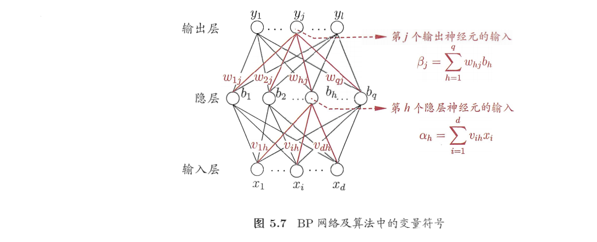
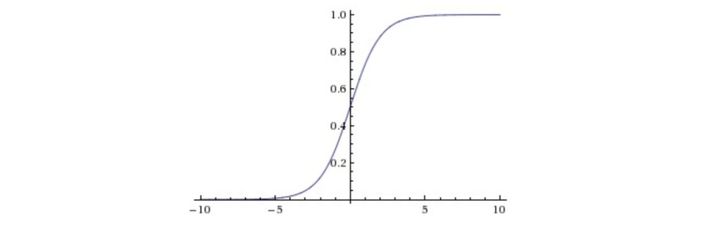
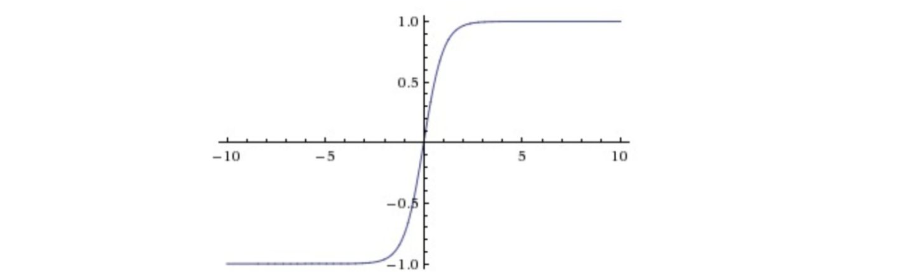
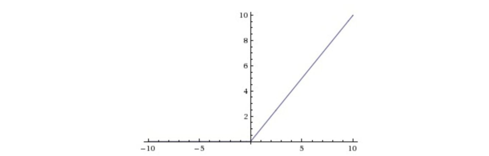

# Neural Network

[TOC]

## The Theory

>最基础的神经网络，也是人们常说的神经网络通常指的是多层感知机，每一层的每一个节点，都会与下面一层所有的节点相连接，及全连接。在卷积神经网络中也称为全连接层。
>
>在这种神经网络中，每一层的每一个节点（及每个神经元）都是一个感知机模型，每个神经元的输出通过激活函数（核函数）之后，输入到下一层神经元。在我的理解中，神经网络模型很大程度上接近于一个黑盒模型，因为说不清他为什么最后分类的效果会这么出色（可能是我不能理解）。在实践操作过程中，更多用经验调整参数，训练也是定义完损失函数，将输入数据规范化后即可。所以下面的文章中主要介绍神经网络如何训练（误差反向传播算法），损失函数的选择，激活函数的选择；


### Backpropagation（反向传播算法）

回顾之前所学的机器学习模型的训练步骤，无论是线性回归，SVM都被最后化成了一个优化问题，优化的目标就是损失函数，使损失函数最小。其实是可以把之前所说的感知机算法中的训练步骤拿来类比，因为神经网络本质上就是由多层多个感知机所组成。只不过其参数更多，训练过程更加的复杂，可能涉及多次求导。

下面以《机器学习》——周志华 书中的简单神经网络来介绍反向传播算法



假设hidden层和输出层都用sigmoid函数。

网络对于训练样例$（x_k，y_k）$的损失函数（这里用均方误差）
$$
E_k=\frac{1}{2}\sum_{j=1}^l(y_j^k-\hat y_j^k)^2
$$
下面我们研究hidden层底h个节点对应j的参数$w_{hj}$,求偏导数
$$
w_{hj}^{new}=w_{hj}+\triangle w_{hj}
$$

$$
\triangle w_{hj}=-\eta \frac{\partial E_k}{\partial w_{hj}}
$$
通过**链式法则**，我们可以将 $ \frac{\partial E_k}{\partial w_{hj}}$拆分成易于求解的形式：
$$
\frac{\partial E_k}{\partial w_{hj}}=\frac{\partial E_k}{\partial \hat y_j^k}\cdot
 \frac{\partial \hat y_j^k}{\partial \beta_j}\cdot
 \frac{\partial \beta_j}{\partial w_{hj}}
$$
然后我们逐步求解

对于$\frac{\partial E_k}{\partial \hat y_j^k}$对上式的Ek进行求导可得：
$$
\frac{\partial E_k}{\partial \hat y_j^k}=y_j^k-\hat y_j^k
$$
对于$\frac{\partial \hat y_j^k}{\partial \beta_j}$，其实它是一个激活函数的求导，因为我们用的激活函数式sigmoid函数，其性质
$$
f_{'}(x)=f(x)(1-f(x))
$$
可知：
$$
\frac{\partial \hat y_j^k}{\partial \beta_j}=\hat {y_j^k}(1-\hat{y_j^k})
$$
对于$ \frac{\partial \beta_j}{\partial w_{hj}}$,我们根据图片右上角的式子进行求导
$$
 \frac{\partial \beta_j}{\partial w_{hj}}=b_h
$$
因此
$$
\triangle w_{hj}=-\eta (y_j^k-\hat y_j^k)\hat {y_j^k}(1-\hat{y_j^k})b_h
$$
可以完成该节点的数据更新。

依次类推，如果是要求第三层节点的更新，通过链式法则：
$$
\frac{\partial E_k}{\partial v_{ih}}=\frac{\partial E_k}{\partial \hat y_j^k}\cdot
 \frac{\partial \hat y_j^k}{\partial \beta_j}\cdot
 \frac{\partial \beta_j}{\partial b_{h}}\cdot
 \frac{\partial b_h}{\partial \alpha_h} \cdot
 \frac{\partial \alpha_h}{\partial v_{ih}}
$$
逐一求导即可。该过程的详细细节可参考西瓜书。

>因此，我们可以知道，在神经网络中参数更新的过程其实也和之前的机器学习的模型相同，按照梯度逼近最优解，只是其求导过程较为复杂，需要用到链式法则进行分步骤求导。
>
>虽然在sklearn中MLP类对神经网络的训练过程进行了封装，但是了解其背后的算法原理总是有用的。


### 激活函数选择

直观来说，激活函数是整个结构中的**非线性扭曲力**，正是因为激活函数，神经网络可以划分非线性数据（例如抑或问题）下面根据发展时间介绍激活函数的种类。


**Sigmoid函数**

这个函数可以说很熟悉了，在logestic回归中我们就用到了这个函数，而且在SVM的kernal选择中也有这个核函数.它的公式在
$$
g(z)=\frac{1}{1+e^{-z}}
$$


取值在(0，1)。适合输出为概率的情况

他的缺点：

- 梯度弥散，当神经元激活在接近0或者1时会饱和，在这些区域梯度几乎为0（可以从图中得知），这就会导致在训练过程中，更新权重十分缓慢，几乎没有更新。
- sigmoid函数不是中心对称的。如果输入神经元的总是正数，那么关于W的梯度在反向传播的过程中将要么全是正数，要么全是负数，这将会导致梯度下降权重更新时出现z字型的下降。
- exp函数 指数计算较为复杂耗时


**tanh函数**
$$
tanh(x)=\frac{e^x-e^{-x}}{e^x+e^{-x}}
$$


在Sigmoid激活函数的基础上解决了中心对称的问题，但是两个缺点还是没有解决：

- 梯度弥散
- exp函数计算开销巨大


**ReLU函数**

现在无论是在视觉还是在自然语言处理领域主流的激活函数
$$
f(x)=max(0,x)
$$


优点：

- 异常简单的计算复杂度，求导为1
- 单侧抑制，在x<0,不激活神经元，更符合生物学上人类的神经元。
- 相对宽阔的兴奋边界，在x∞时依旧不会产生梯度弥散问题
- 稀疏激活性，x<0，会使一些神经元"死亡"，（这也是一个缺点）

缺点：

- reLU函数会造成神经元死亡，而这种死亡是不可逆转的，因此导致了数据多样化的丢失。下面的Leaky ReLU 稍稍解决了这些问题。


**Leaky ReLU**
$$
f(x)=max(ex,x)
$$


其中e是一个很小的负值梯度，上文介绍ReLU函数的时候说过，ReLU函数的缺点，神经元不可逆转死亡，那么引入了Leaky ReLU就解决了这个问题，这样使得神经元在处于非激活状态的情况下，信息不会完全丢失。


>这里只介绍了sklearn库里面可选的激活函数(无 Leaky ReLU),但其实还有很多激活函数，在深度学习库中例如Pytorch，tensorflow，激活函数是可以自己定义的。现在sigmoid函数在深度学习中已经很少见到了，基本上在很多论文中都是利用的ReLU一类的函数。激活函数的选择对于训练和预测的效率速度有很大的影响。


### 损失函数的选择

>在上文中提到很多次，在机器学习的很多问题中，我们都可以把整个问题简化成一个优化问题，而优化的目标函数就是损失函数。
>
>在用神经网络解决的大部分问题中，网络结构大部分是固定的（例如我可以用Resnet网络的结构原封不懂的去提取特征，或者只是对网络的结构进行一些fine tune 微调）。而主要工作在如何清洗出高质量的输入数据和改善损失函数上面（例如可以在损失函数后面加上一些正则项或者惩罚项，来对特定问题的结果进行调整。就像在SVM中的过程一样，加一些限制条件，使得模型更加精准）因此损失函数的选择和调整在用神经网络解决具体问题的过程中十分重要。
>
>下面介绍两个基本的损失函数


**距离损失函数（最小误差标准 Minimum Squared Error,mse）**

这个损失函数在SVM，回归分析中都用到了，是非常常见的损失函数，度量预测值与真实值的欧式距离
$$
L(y,\hat y)=\frac{1}{2}(y-\hat y)^2
$$
直观意义非常明确：预测值与真值的距离越大，损失就越大，反之就越小。


**交叉熵损失函数（Cross Entropy）**

交叉熵是信息论中的一个概念，在统计学中交叉熵的表现形式和最大似然法很相似。具体原理也不深究了，它定义了在一个概率分布上。根据公式，可以看到 负号内部的就是**最大似然法**的表现形式。
$$
L(y,\hat y)=-[y ln \hat y+(1-y)ln(1-\hat y)]
$$
交叉熵损失函数在基础的深度学习模型熵用的十分普遍，实践效果也很好


**如何选择损失函数**

**损失函数通常要结合输出层的激活函数来进行选取**，在BP算法中我们可以知道，链式法则求导过程中，第一步计算的局部梯度，是由损失函数对模型输出的梯度和激活函数的导数相乘得到的。而观察损失函数可以知道，损失函数一般较为复杂，通过选择相应的激活函数，能与激活函数的导数相乘简化运算或者降低激活函数本身的缺点带来的影响。下面介绍几种较为常见的组合及其优缺点。


**Sigmoid+MSE**

在logistic regression中就是这样的组合。

这样的组合未能解决Sigmoid函数梯度弥散的问题，对于某些极大的输入，模型参数更新十分缓慢。


**Sigmoid+Cross Entropy**

这里Cross Entropy 的导数
$$
L^{'}(y,\hat y)=-[\frac{y}{\hat y}-\frac{1-y}{1-\hat y}]=-\frac{y-\hat y}{\hat y(1-\hat y)}
$$
联系sigmoid的导数
$$
f_{'}(y)=\hat {y}(1-\hat{y})
$$
sigmoid 梯度弥散的根本原因就是当 $\hat y$趋紧与0或者1时$f^{'}(y)$会无穷小，导致更新换缓慢。但是如果选择Cross Entropy 从数学上来说 梯度弥散的问题就被完美解决了。


**Softmax+Cross Entropy**

在经典深度学习模型LeNet中的最后一层就是softmax+Cross Entropy. 

Softmax模型感觉上不像是一个激活函数，更像一个向量变换。能把模型的输出向量，归一化成一个概率向量。在多分类问题中Softmax模型用了很多。softmax函数的导函数形式与sigmoid相同。


>总结：
>
>在机器学习实验中，其实可以把上述的算法作为一个黑盒子来进行操作。利用sklearn里面的自动调参的API对其进行暴力便利，但是这是对于少量的数据集。
>
>对于工业界的应用或者大数据比赛来说，数据集往往巨大，如果有懂得神经网络训练的算法细节，对应不同的项目和需求，调整损失函数（加正则项，惩罚项之类的），可以大大减少训练的时间，提高模型的得分。


## Neural Network in Sklearn

>首先需要说明的是，Sklearn库中的关于深度学习的API是非常有限的。它只提供了一个多层感知机的接口。
>
>完整的自定义程度更高深度学习模型还需用tensorflow或者pytorch来进行实现
>
>实验源码：[https://github.com/Zrealshadow/MachineLearning/tree/master/LAB4%20MLP](https://github.com/Zrealshadow/MachineLearning/tree/master/LAB4 MLP)

在sklearn中，提供了两类多层感知机，一种是有监督学习多层感知机，一种是无监督学习的多层感知机。下面主要介绍有监督多层感知机的API的调用方法，也是实验中所用到的方法

另外要补充的是，在sklearn中MLP的损失函数是无法自定义的，它给固定成了：
$$
Loss(\hat y,y,W)=\frac{1}{2}||\hat y-y||^2+\frac{\alpha}{2}||W||^2
$$
（此处的W是MLP网络结构中的参数）

这就是上文所说的在MSE损失函数的基础上加上一个W的L2正则项，限定了参数的大小，具体原因参考上文Ridge回归。

```python
# 多层感知机分类模型
class sklearn.neural_network.MLPClassifier(hidden_layer_sizes=(100, ), activation=’relu’, solver=’adam’, alpha=0.0001, batch_size=’auto’, learning_rate=’constant’, learning_rate_init=0.001, power_t=0.5, max_iter=200, shuffle=True, random_state=None, tol=0.0001, verbose=False, warm_start=False, momentum=0.9, nesterovs_momentum=True, early_stopping=False, validation_fraction=0.1, beta_1=0.9, beta_2=0.999, epsilon=1e-08, n_iter_no_change=10)

'''
----------parameter-------------
@param:hidden_layer_sizes  tuple, length = n_layers - 2, default (100,)
神经网络的结构，输入一个元组，元组的第i个元素，代表网络中第i层的神经元的个数

@param: activation  {'identity', 'logistic', 'tanh', 'relu'}, default 'relu'
激活函数的选择，其中’identity'是 f(x)=x，其他的激活函数上文都提过

@param：solver {'lbfgs', 'sgd', 'adam'}, default 'adam'
梯度下降法的方式，上面三个选项都是梯度下降法的优化方法：
	- 'lbfgs'：quasi-Newton方法的优化器 
	- 'sgd'：随机梯度下降
	- 'adam'：随机梯度下降法的优化方法
	注：在很多数据集中‘adam'无论是训练的效率和准确度都是最好的
	在小数据集上，'lbfgs'的速度可能表现更好
	
@param：alpha float, optional, default 0.0001
正则化项的系数，系数越大，多层感知机对于参数的要求越严格

@param:batch_size  int, optional, default 'auto'
批处理的大小，一次处理几项数据，当设置为auto，batch_size=min(200,n_samples) 
一般设置成2的次方训练速度可以提高

@param:learning_rate  {'constant', 'invscaling', 'adaptive'}, default 'constant'
学习速率的更新状态：
	- 'constant'： 给予恒定的学习速率
	- 'incscaling'：随着训练时间t，不断降低的学习速率 
		 effective_learning_rate =learning_rate_init / pow(t, power_t) power_t 在后面参数设定
	- 'adaptive':只要训练损耗在下降，就保持学习率为’learning_rate_init’不变，当连续两次不能降低训练损			耗或验证分数停止升高至少tol时，将当前学习率除以5. 
注：只有当solver是‘sdg'时可以使用

@param: learning_rate_init  double, optional, default 0.001
初始学习速率

@param:  power_t double, optional, default 0.5，
见上文 'incscaling' 方法的学习速率更新

@param:max_iter: int, optional, default 200
最大迭代次数

@param: shuffle : bool, optional, default True
每次迭代后是否打乱样本集

@param:  tol float, optional, default 1e-4
对损失函数提升的容忍度，如果再一次迭代中，损失函数下降的数值小于tol，停止训练

@param:verbose : bool, optional, default False
是否打印训练过程

@param:warm_start : bool, optional, default False
是否沿用之前模型中已经有的参数继续训练

@param: momentum : float, default 0.9 
在0-1 之间 ，随机梯度下降中的动量的参数

@param：early_stopping : bool, default False
是否提前停止，如果true，模型将拿出训练集的10%作为测试集来验证，如果正确率不再提高，停止训练

@param: validation_fraction : float, optional, default 0.1
如果提前停止，作为测试集的比例


---------attribute----------

@attr: class_  array or list of array of shape (n_classes,)
返回分类的种类

@attr:loss_ : float
返回最后的损失函数

@attr:n_iter:int
返回迭代次数

@attr:n_layers_ : int
返回神经网络的层数

@attr:out_activation_ : string
返回激活函数
'''

#MLP回归模型
class sklearn.neural_network.MLPRegressor(hidden_layer_sizes=(100, ), activation=’relu’, solver=’adam’, alpha=0.0001, batch_size=’auto’, learning_rate=’constant’, learning_rate_init=0.001, power_t=0.5, max_iter=200, shuffle=True, random_state=None, tol=0.0001, verbose=False, warm_start=False, momentum=0.9, nesterovs_momentum=True, early_stopping=False, validation_fraction=0.1, beta_1=0.9, beta_2=0.999, epsilon=1e-08, n_iter_no_change=10)
'''
方法属性参数与分类模型相同，见上。
'''
```

